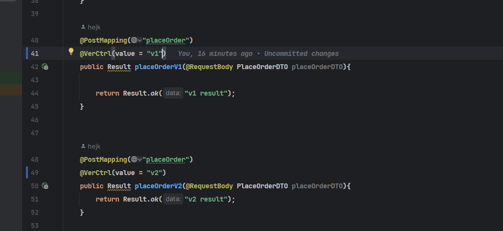

# 接口版本控制

引入该依赖可以在不改变接口名的情况下，控制请求访问不同的接口版本

## 使用方法

1. mvn install 之后引入到自己的项目中
2. 配置文件配置

   ``spring.main.allow-bean-definition-overriding = true``
3. 接口层使用注解
   

支持请求头和请求参数进行控制
注解相关参数详解

```java
public @interface VerCtrl {
    /**
     * 版本控制的参数存放在哪
     * 默认放在header里面
     */
    VerCtrlType type() default VerCtrlType.HEADER;

    /**
     * 决定被注解的接口处理哪个版本的请求
     * 
     */
    String value();

    /**
     * 版本参数的key
     * 制定了前端的版本key
     */
    String key() default "version";


    /**
     * 前缀 比如v1.3 前缀就是v，后续进行版本大小比较时会去除这个前缀
     * @return
     */
    String suffix() default "v";

    /**
     * 版本比较器，比较哪个版本最新
     * 当当前请求的版本比所有版本接口版本都高，则选版本最高的接口
     */
    Class<?> verComparator() default StringVerComparator.class;
}


```

注意：当前不支持请求里面的版本号携带前缀

版本映射关系图如下：


客户端版本过低会报错，客户端版本过高会选择所有接口里面版本最高的一个

如果有相同版本的请求，运行时会出现请求重复错误，暂不支持启动时的检查，后续支持!
